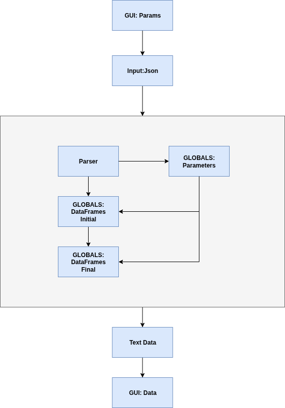

%%writefile cache/get_started.md
# Getting Started

**Introduction**

Data Generation is Desktop application used to generate data for GSM USIM and ESIM as per ETSI Standards.

**Architecture**

We have some requirements from this tool like we need data as per user requirement as per user required format. For this we need to develop core python library as core component of this tool following `3GPP` and `ETSI` Standards.

<!-- 
 -->
